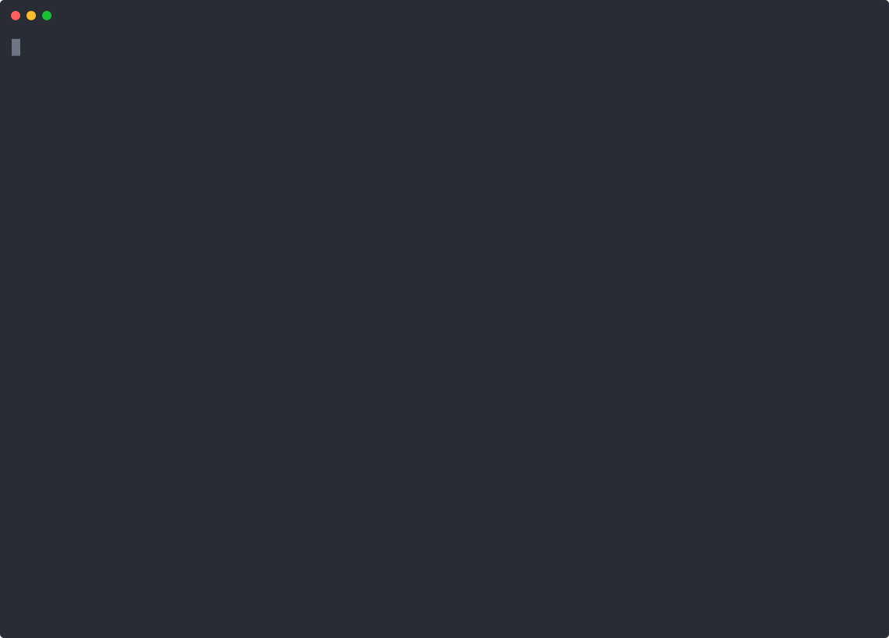
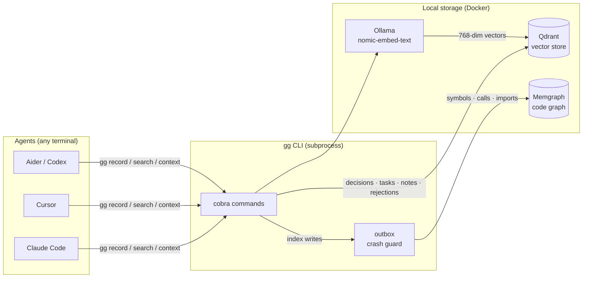

# gg — One brain, any agent

[](https://github.com/gurkangul/gg-cli/actions/workflows/ci.yml)
[](https://github.com/gurkangul/gg-cli/releases/latest)
[](go.mod)
[](LICENSE)
[](https://github.com/gurkangul/gg-cli/releases)

> **Status: Alpha.** API and storage format may change between releases.
> Suitable for personal projects and early adopters. Not recommended for
> production multi-team environments yet.

**gg** is a shared knowledge base CLI for multi-agent AI development setups.

When you run several AI agents in parallel (different terminals, different roles), each one starts with a blank slate. gg fixes the three failure modes that follow:

| Problem | What gg does |
|---|---|
| Every agent re-derives the same context | Shared decisions, rejections, and notes — searchable by all agents |
| Impact-blind fixes create fix loops | `gg index` builds a code graph; `gg context` surfaces what a change touches |
| Rejected approaches get retried | Rejections are first-class records, returned by `gg search` |

**One brain. Any agent. Subprocess interface — no daemon, no REST.**

---

## Agent install

Pick the path that matches the agent you use. All paths keep gg as a local
CLI/subprocess tool; no MCP server or hosted service is required.

| Agent | Install path |
|---|---|
| Codex | `go install github.com/gurkangul/gg-cli/cmd/gg@latest`, then `gg init`; Codex reads project `AGENTS.md`. Optional global reminder: `~/.codex/instructions.md`. |
| Claude Code | Install `gg`, run `gg init`, then `gg doctor --install-agent-hooks`; Claude reads generated `CLAUDE.md`/`AGENTS.md`. |
| Cursor | Install `gg`, run `gg init`, then `gg doctor --install-agent-hooks`; Cursor reads generated `.cursor/rules/gg.mdc`. |
| Manual shell | `export GG_AGENT=manual GG_ROLE=developer`, then run `gg status` and `gg inbox --role "$GG_ROLE" --since-cursor` at session start. |

See [docs/agent-native-install.md](docs/agent-native-install.md) for the
session-start, task, reviewer, and search/context/impact/inbox workflow.

---



<!-- 90s demo embed placeholder — generated from docs/demo/record.sh -->
<!-- See docs/demo/STORYBOARD.md for the recording script -->

---

## Why this exists

Running multiple AI agents in parallel is increasingly common — different terminals, different specializations, different tasks. The problem is that each agent starts with a blank slate every time. Three failure modes follow reliably:

1. **Every agent re-derives the same context.** Agent A figures out the auth approach; Agent B spends 10 minutes reaching the same conclusion. Multiply by n agents and n sessions.
2. **Impact-blind fixes create fix loops.** An agent patches a symptom without knowing what else calls the function. The next agent sees the symptom again and patches it again.
3. **Rejected approaches keep getting re-proposed.** "What about using Redis for the session store?" — answered three times across three sessions because nothing remembered the rejection.

gg is a shared brain. Agents call it as a subprocess. Decisions, rejections, tasks, and code-graph facts live in a local vector store that all agents query. A decision made by one is immediately visible to the others.

---

## Prerequisites

**Required:** [Docker](https://docs.docker.com/get-docker/) with Compose v2.
`gg init` runs the three services below as containers via a shared
`~/.gg/docker-compose.yaml` — no manual install needed for Qdrant /
Memgraph / Ollama.

| Service | Purpose | Default |
|---|---|---|
| [Qdrant](https://qdrant.tech) | Vector store (decisions, tasks, notes, bugs, …) | `localhost:6334` |
| [Ollama](https://ollama.ai) | Local embeddings | `http://localhost:11434` |
| [Memgraph](https://memgraph.com) | Code knowledge graph (optional, for `gg index`) | `bolt://localhost:7687` |

Embedding model: `nomic-embed-text` (768-dim) — `gg init` pulls this
into the Ollama container automatically on first run.

---

## Install

### Go install

```sh
go install github.com/gurkangul/gg-cli/cmd/gg@latest
```

The binary is `gg`. The repo is `gg-cli` for descriptiveness; the
command stays short.

If the first tagged release is not available yet, install from the current
main branch instead:

```sh
go install github.com/gurkangul/gg-cli/cmd/gg@main
```

### Build from source

```sh
git clone https://github.com/gurkangul/gg-cli
cd gg-cli
go build -o gg ./cmd/gg
```

---

## Quick start

```sh
# 1. Initialize gg for a project (run once per project)
cd /path/to/your/project
gg init

# 2. Verify services and binaries
gg doctor

# 3. Install agent hooks so Claude/Codex/Cursor sessions load gg context
gg doctor --install-agent-hooks

# 4. Record a decision
gg record "use JWT for auth" --reason "stateless, scales well" --tags "auth,api"

# 5. Create a task
gg task create "add auth middleware" \
  --detail "protect API routes using the JWT decision" \
  --priority high \
  --requester user

# 6. Search context before making a change
gg context "authentication"

# 7. Check status (what tasks are open, any unread messages?)
gg status
```

For code-impact queries, install SCIP indexers and index the repo:

```sh
gg doctor --install-indexers
gg index --lang go
```

---

## Commands

### Session / context

| Command | Description |
|---|---|
| `gg status` | Open tasks, pending messages, recent decisions |
| `gg search "topic"` | Semantic search over decisions and rejections |
| `gg context "topic"` | Unified context bundle: decisions + rejections + notes + code graph |

### Decisions & rejections

| Command | Description |
|---|---|
| `gg decide "text" --reason "why" --tags "t1,t2"` | Record a decision |
| `gg reject "text" --reason "why" --tags "t1,t2"` | Record a rejected approach |

### Tasks

| Command | Description |
|---|---|
| `gg task create "title" --detail "…" --priority high --requester user` | Open a task |
| `gg task list` | List tasks (add `--ready` to filter unblocked ones) |
| `gg task get TASK-ID` | Show task details |
| `gg task done TASK-ID "summary"` | Mark a task as done |
| `gg task block TASK-ID --reason "…"` | Mark a task as blocked |
| `gg task deps TASK-ID` | Show dependency status |

### Bugs

| Command | Description |
|---|---|
| `gg bug report "title" --detail "…" --severity high` | Report a bug |
| `gg bug list` | List bugs |
| `gg bug start BUG-ID` | Move to "fixing" |
| `gg bug fix BUG-ID "summary"` | Mark as fixed |
| `gg bug wontfix BUG-ID "reason"` | Close as won't-fix |
| `gg bug triage BUG-ID` | Auto context bundle for fixing |

### Messaging between agents

```sh
gg tell "developer" "TASK-017 done: auth middleware ready" --from architect
gg inbox                  # read your messages
```

### Code index (requires Memgraph)

```sh
gg index --lang go               # full index
gg index --lang go --changed     # incremental (delta from last indexed SHA)
gg index --lang typescript
gg index --lang python
```

Supported indexers: `scip-go`, `scip-typescript`, `scip-python`.

**Monorepos.** If the language manifest (`go.mod`, `package.json`,
`pyproject.toml`) is not at the project root, `gg index` walks up to
`doctor.hook_install.max_depth` (default `3`) subdirectories and runs the
SCIP indexer once per discovered module. Stored paths are always relative
to the project root, so `gg impact lift-cli/cmd/foo.go` works whether or
not `lift-cli/` is the Go module root.

### Keeping agent context small

gg output grows with the knowledge base; on mature projects a single `gg
context` can span hundreds of lines. Three orthogonal options:

- `--compact` on verbose commands — one line per item (IDs, titles, dates),
  no reasons or detail bodies. The agent picks which items to fetch in full:

  ```sh
  gg context "auth" --compact
  gg search "jwt" --compact
  gg task get TASK-042 --compact
  gg task list --compact
  gg bug list --compact
  gg inbox --compact
  gg impact src/auth.go --compact
  gg impact TASK-042 --compact
  ```

- **Agent auto-compact** — agents can skip the flag entirely. When `GG_ROLE`
  or `GG_AGENT` is set (installed automatically by `gg doctor
  --install-agent-hooks`), every compact-capable command defaults to compact
  output. Humans keep the rich default. Override either direction:

  ```sh
  GG_COMPACT=1 gg task list              # force compact regardless of env
  gg task list --compact=false           # agent opts out for debugging
  ```

  Resolution order: explicit `--compact` flag > `GG_COMPACT` env >
  `GG_ROLE`/`GG_AGENT`/`--from` origin > off. `gg status` surfaces the
  dogfood savings (`Compact  74 calls, 208.5 KB / ~53K tok saved`).

- A generic shell-output compressor like [RTK](https://github.com/rtk-ai/rtk)
  transparently shrinks all tool output (git, tests, gg) before it reaches
  the model's context. Independent of gg; optional.

### Observability (GG_TRACE=1)

| Command | Description |
|---|---|
| `gg trace show [--op=X] [--since=1h] [--limit=N]` | Print recorded spans, newest first |
| `gg trace summary [--since=1h]` | Per-operation p50/p95/p99 latency breakdown |
| `gg trace clear [--older-than=7d]` | Delete old trace JSONL files |

Enable recording: `GG_TRACE=1 gg search "topic"`. See [`docs/commands/trace.md`](docs/commands/trace.md) for details.

### Ops

| Command | Description |
|---|---|
| `gg init` | Initialize Qdrant collections and register project |
| `gg doctor` | Check service connectivity and indexer binaries |
| `gg doctor --install-indexers` | Auto-install missing SCIP binaries |
| `gg doctor --install-task-hooks` | Install verify-gate hooks (auto-detects Go / Node / Bun) |
| `gg doctor --reconcile` | Surface incomplete dual-store writes and show repair commands |
| `gg reembed --confirm` | Migrate all collections to the currently configured embedding model |

#### Verify gate

`gg task done` runs every `*.sh` in `.gg/hooks/pre-task-done.d/` **before** writing the new state. Any non-zero exit aborts the transition with exit code `7` (`ExitVerifyFailed`) — the task stays in its current state.

On rejection three signals fire in parallel:
1. A human-readable line on **stderr** explaining which hook failed and why.
2. A machine-parseable **NDJSON line** on stderr: `{"event":"verify_failed","gate":"pre-task-done","task":"TASK-ID","hook":"script.sh","exit":1,"ts":"…","detail":"…"}` — parse it with `jq` or any JSON reader.
3. An automatic cross-agent **`gg tell`** from `verify-gate` to `all` so parallel sessions see the rejection in `gg status`.

Install the starter hooks with `gg doctor --install-task-hooks`. Suppress the broadcast in CI or reentrant scripts with `GG_NO_AUTO_NOTIFY=1`.

---

## Configuration

`gg init` creates `.gg/config.yaml` in the project root. Edit to match your setup:

```yaml
project_id: <uuid>              # auto-generated by gg init — do not edit
qdrant:
  host: localhost
  port: 6334
embedding:
  host: http://localhost:11434
  model: nomic-embed-text
memgraph:
  uri: bolt://localhost:7687
  username: ""
  password: ""                  # leave empty; use MEMGRAPH_PASSWORD instead (see below)
```

### Security — Credentials

**Never write a Memgraph password into `.gg/config.yaml`.**
The file is easy to accidentally commit. Use environment variables instead — they
override the corresponding config fields at runtime:

| Env var | Overrides |
|---|---|
| `MEMGRAPH_PASSWORD` | `memgraph.password` |
| `MEMGRAPH_USERNAME` | `memgraph.username` |
| `MEMGRAPH_URI` | `memgraph.uri` |

```sh
# Shell or .env (gitignored)
export MEMGRAPH_PASSWORD="your-password"
gg status   # password is picked up automatically
```

Add `.gg/config.yaml` to your project's `.gitignore` as an extra precaution
(the project UUID inside is not secret, but belt-and-suspenders never hurts):

```
.gg/config.yaml
```

---

## Multi-agent pattern

Install agent hooks once per project so each agent gets the shared-brain
briefing at session start:

```sh
gg doctor --install-agent-hooks
```

Each agent then runs through `gg session-start` and sees `gg status`,
recent decisions, pending tasks, and any managed policy repairs. For manual
sessions, set an identity and run it explicitly:

```sh
export GG_AGENT="${GG_AGENT:-agent}"  # set to this runtime's name, e.g. codex/cursor/aider
gg session-start --agent "$GG_AGENT"
```

```
Agent A (architect)          Agent B (developer)          Agent C (reviewer)
gg status                    gg status                    gg status
↓                            ↓                            ↓
sees open tasks,             picks up TASK-017,           sees decision about auth,
unread messages              gg decide "JWT chosen"       gg search "JWT" → finds it
```

All agents write to the same Qdrant + Memgraph backend. A decision made by one is immediately visible to the others.

For master/worker flows, opt in from the master session:

```sh
gg become master
GG_ROLE=master gg spawn heartbeat --watch --poll 90 &
```

The heartbeat watcher keeps worker-pane supervision visible; `gg session-start`
warns when worker panes exist but the master heartbeat is missing or stale.

---

## Architecture



```
gg (CLI)
├── cmd/           — cobra commands
├── internal/
│   ├── store/     — Qdrant client (decisions, tasks, bugs, notes, discussions, messages)
│   ├── graph/     — Memgraph client (code knowledge graph: Symbol, File, Package nodes)
│   ├── index/
│   │   ├── parser/    — SCIP file parser
│   │   ├── runner/    — SCIP indexer resolution and execution
│   │   ├── changed/   — git diff + IsAncestor for incremental indexing
│   │   ├── state/     — index-state.json (last indexed SHA)
│   │   └── compat/    — indexer version manifest
│   ├── embedding/ — Ollama embedding generator + model metadata
│   └── outbox/    — file-based crash-safety queue for Memgraph writes
└── AGENTS.md      — agent behavior rules (session start, decisions, tasks, …)
```

**Isolation:** every Qdrant point and every Memgraph node carries a `project_id` property. Multiple projects can share the same backend without data leakage.

**Crash safety:** `gg index` writes an outbox entry before touching Memgraph. On success the entry is deleted. If the process dies mid-write, `gg doctor --reconcile` surfaces the pending entry and shows the exact repair command.

---

## Tech Stack

| Layer | Technology | Why |
|---|---|---|
| CLI framework | [Cobra](https://github.com/spf13/cobra) | Idiomatic Go subcommand routing |
| Language | Go 1.26.2 | Single-binary distribution, no runtime deps |
| Vector store | [Qdrant](https://qdrant.tech) via gRPC | Semantic search on decisions, tasks, notes, rejections |
| Code graph | [Memgraph](https://memgraph.com) via Bolt | Structural queries: `CALLS`, `IMPORTS`, `DEFINES` |
| Embeddings | [Ollama](https://ollama.ai) — `nomic-embed-text` 768-dim | Local, no API key, runs in the same Docker stack |
| Code indexers | SCIP (`scip-go`, `scip-typescript`, `scip-python`) | Language-agnostic symbol graph with cross-file resolution |

---

## Engineering Decisions

Decisions that shaped the design — and why the alternatives lost.

**No daemon, subprocess interface only.**
A background daemon would require a service manager, a PID file, and crash recovery. Instead, `gg` is a stateless CLI: agents call it as a subprocess, Docker provides the stores. This eliminated an entire class of process-lifecycle bugs and kept the distribution a single binary. See [docs/architecture.md](docs/architecture.md).

**Two-store architecture: Qdrant + Memgraph.**
Decisions, tasks, and rejections need fuzzy semantic search (`gg search "auth"` should surface JWT discussions even if the query doesn't match exact words). Code impact queries need structural traversal (`gg impact src/auth.go` follows call chains). A single store forces a compromise in both. Two purpose-built stores, one per query type.

**`gg record` with `--stance` flag instead of separate `decide`/`reject` verbs.**
Early design had six command verbs. Five (record, note, task, bug, discuss) covers the full lifecycle with less surface area. `gg decide` and `gg reject` remain as aliases for agent compatibility, but `record --stance=accept|reject` is canonical. See the 6→5 verb taxonomy decision.

**JSONL-primary brain writes with Qdrant as derived index.**
`gg record`, `gg task create`, and `gg bug report` write to `.gg/brain/<kind>.jsonl` first, then attempt a Qdrant upsert.  When Qdrant is unreachable the write still succeeds (exit 0) and an outbox entry is queued for later replay.  `gg doctor --reconcile` drains the outbox when Qdrant recovers.  `gg search` falls back to a local JSONL text scan when Qdrant is unavailable, printing an offline banner.  See [docs/offline-resilience.md](docs/offline-resilience.md) for the full design.

**Outbox pattern for dual-store consistency.**
When `gg index` writes to both Qdrant and Memgraph, a crash between the two writes leaves the stores out of sync. gg writes a `.gg/outbox/<id>.json` entry before the Memgraph write and deletes it on success. `gg doctor --reconcile` surfaces any dangling entries and replays pending brain writes to Qdrant. No saga framework, no distributed transaction — just a file and a reconciler.

**`project_id` as the isolation primitive.**
Rejected: Memgraph 3.x multi-database feature (not broadly available, adds infra coupling). Chosen: every Qdrant point and every Memgraph node carries a `project_id` UUID injected at the `runQuery` level in `internal/graph/queries.go`. A new project gets a new UUID from `gg init`; shared infra at `~/.gg/` serves all projects without data leakage.

**SCIP-first hybrid parser (SCIP + tree-sitter fallback).**
Pure SCIP gives high-quality cross-file symbol resolution for supported languages (Go, TypeScript, Python via `scip-go`, `scip-typescript`, `scip-python`). Tree-sitter covers languages with no SCIP indexer. The spike showed scip-go at 0.97s for one repo, 3.78ms ParseFile, 1365 symbols — enough for the current alpha, not a broad production claim. Rejected: writing a custom AST parser (maintenance surface); Docker-based SCIP fallback (day-1 complexity).

---

## Telemetry (local-only, opt-out)

`gg` writes a single JSON line per command to `~/.gg/projects/<project_id>/telemetry.jsonl`
recording verb usage (which `gg` commands ran, agent vs human). This data is
**strictly local — never sent anywhere over the network** — and powers gg's
own dogfood metric (DISC-008): are agents actually following AGENTS.md rules?

The file is append-only; you can rotate, inspect, or delete it freely.

Disable with:

```bash
export GG_TELEMETRY=0   # also: false, no, off
```

---

## Documentation

| Doc | Purpose |
|---|---|
| [docs/demo.svg](docs/demo.svg) | Animated terminal demo (also: [demo.cast](docs/demo.cast)) |
| [docs/getting-started.md](docs/getting-started.md) | Installation and first run |
| [docs/commands.md](docs/commands.md) | Full command reference |
| [docs/cli/](docs/cli/) | Auto-generated per-command CLI reference (regenerated by `go run ./tools/docs-gen`) |
| [docs/architecture.md](docs/architecture.md) | Package layout, crash safety, isolation |
| [docs/adapters.md](docs/adapters.md) | Agent integrations, SCIP indexers, git hooks |
| [docs/roadmap.md](docs/roadmap.md) | Phase plan and vision (historical) |
| [AGENTS.md](AGENTS.md) | Agent behavior contract (runtime) |

---

## Roadmap

| Phase | Status | Scope |
|---|---|---|
| Phase 1 — Core CLI | ✅ Done | Record/search/task/bug/discuss/note/tell, Qdrant store, AGENTS.md protocol |
| Phase 2 — Code Intel | ✅ Done | `gg index`, `gg impact`, `gg context`, SCIP parsers, Memgraph graph, outbox crash safety |
| Phase 3 — Adoption polish | ✅ Done | README/docs quality, multi-tenancy, agent hook enforcement, `gg session-start`, April 2026 dogfood validation |

See [docs/roadmap.md](docs/roadmap.md) for the detailed phase plan.

---

## Contributing

Contributions welcome. See [CONTRIBUTING.md](CONTRIBUTING.md) for guidelines.

For security issues, see [SECURITY.md](SECURITY.md) — please do not open a public issue.

---

## License

MIT — see [LICENSE](LICENSE).
