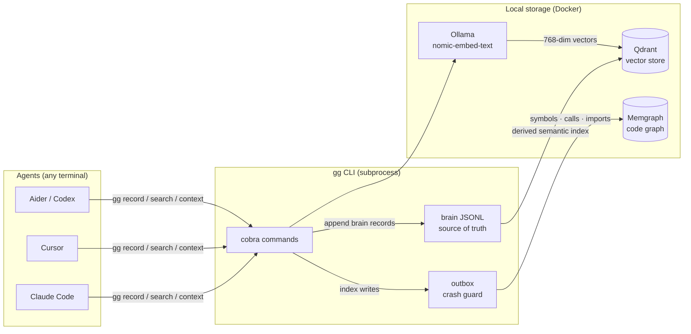

# gg — One brain, any agent

[](https://github.com/gurkangul/gg-cli/actions/workflows/ci.yml)
[](https://github.com/gurkangul/gg-cli/releases/latest)
[](go.mod)
[](LICENSE)
[](https://github.com/gurkangul/gg-cli/releases)

> **Status: Alpha.** API and storage format may change between releases.
> Suitable for personal projects and early adopters. Not recommended for
> production multi-team environments yet.

**gg** is a shared knowledge base CLI for multi-agent AI development setups.

When you run several AI agents in parallel (different terminals, different roles), each one starts with a blank slate. gg fixes the three failure modes that follow:

| Problem | What gg does |
|---|---|
| Every agent re-derives the same context | Shared decisions, rejections, and notes — searchable by all agents |
| Impact-blind fixes create fix loops | `gg index` builds a code graph; `gg context` surfaces what a change touches |
| Rejected approaches get retried | Rejections are first-class records, returned by `gg search` |

**One brain. Any agent. Subprocess interface — no daemon, no REST.**

---

## Agent install

Pick the path that matches the agent you use. All paths keep gg as a local
CLI/subprocess tool; no MCP server or hosted service is required.

| Agent | Install path |
|---|---|
| Codex | `go install github.com/gurkangul/gg-cli/cmd/gg@latest`, then `gg init`; Codex reads project `AGENTS.md`. Optional global reminder: `~/.codex/instructions.md`. |
| Claude Code | Install `gg`, run `gg init`, then `gg doctor --install-agent-hooks`; Claude reads generated `CLAUDE.md`/`AGENTS.md`. |
| Cursor | Install `gg`, run `gg init`, then `gg doctor --install-agent-hooks`; Cursor reads generated `.cursor/rules/gg.mdc`. |
| Manual shell | `export GG_AGENT=manual GG_ROLE=developer`, then run `gg status` and `gg inbox --role "$GG_ROLE" --since-cursor` at session start. |

See [docs/getting-started.md](docs/getting-started.md) for the
session-start, task, reviewer, and search/context/impact/inbox workflow.

---

## Quick peek

```text
$ gg status
TASKS:
  ○ Pending: 3  → In Progress: 1  ✓ Done: 18
MESSAGES:
  Unread: 2
RECENT DECISIONS:
  • Use JWT for auth
  ✗ Raw SQL migration rollback was rejected

$ gg search "auth" --compact
D  2026-05-12  Use JWT for auth
R  2026-05-12  Raw SQL migration rollback
T  TASK-017     Add auth middleware
```

---

## Prerequisites

**Required:**

- [Go](https://go.dev/doc/install) matching the version in [`go.mod`](go.mod)
  for `go install` / source builds.
- [Docker](https://docs.docker.com/get-docker/) with Compose v2.

`gg init` runs the three services below as containers via a shared
`~/.gg/docker-compose.yaml` — no manual install needed for Qdrant /
Memgraph / Ollama.

| Service | Purpose | Default |
|---|---|---|
| [Qdrant](https://qdrant.tech) | Vector store (decisions, tasks, notes, bugs, …) | `localhost:6334` |
| [Ollama](https://ollama.ai) | Local embeddings | `http://localhost:11434` |
| [Memgraph](https://memgraph.com) | Code knowledge graph (optional, for `gg index`) | `bolt://localhost:7687` |

Embedding model: `nomic-embed-text` (768-dim) — `gg init` pulls this
into the Ollama container automatically on first run.

---

## Install

### Go install

```sh
go install github.com/gurkangul/gg-cli/cmd/gg@latest
```

For unreleased development builds, install from the current main branch:

```sh
go install github.com/gurkangul/gg-cli/cmd/gg@main
```

The binary is `gg`. The repo is `gg-cli` for descriptiveness; the
command stays short.

Update later with:

```sh
gg update check
gg update
```

Session-start update checks are opt-in because they use the Go module
network path:

```sh
GG_UPDATE_CHECK=1 gg session-start --agent=codex
```

### Build from source

```sh
git clone https://github.com/gurkangul/gg-cli
cd gg-cli
go build -o gg ./cmd/gg
```

---

## Quick start

```sh
# 1. Initialize gg for a project (run once per project)
cd /path/to/your/project
gg init

# 2. Verify services and binaries
gg doctor

# 3. Install agent hooks so Claude/Codex/Cursor sessions load gg context
gg doctor --install-agent-hooks

# 4. Record a decision
gg record "use JWT for auth" --reason "stateless, scales well" --tags "auth,api"

# 5. Create a task
gg task create "add auth middleware" \
  --detail "protect API routes using the JWT decision" \
  --priority high \
  --requester user

# 6. Search context before making a change
gg context "authentication"

# 7. Check status (what tasks are open, any unread messages?)
gg status
```

For code-impact queries, install SCIP indexers and index the repo:

```sh
gg doctor --install-indexers
gg index --lang go
```

---

## Commands

### Session / context

| Command | Description |
|---|---|
| `gg status` | Open tasks, pending messages, recent decisions |
| `gg search "topic"` | Semantic search over decisions and rejections |
| `gg context "topic"` | Unified context bundle: decisions + rejections + notes + code graph |

### Decisions & rejections

| Command | Description |
|---|---|
| `gg record "text" --reason "why" --tags "t1,t2"` | Record a decision |
| `gg record "text" --decision-status rejected --reason "why" --tags "t1,t2"` | Record a rejected approach |

### Tasks

| Command | Description |
|---|---|
| `gg task create "title" --detail "…" --priority high --requester user` | Open a task |
| `gg task list` | List tasks (add `--ready` to filter unblocked ones) |
| `gg task get TASK-ID` | Show task details |
| `gg task done TASK-ID "summary"` | Mark a task as done |
| `gg task block TASK-ID --reason "…"` | Mark a task as blocked |
| `gg task deps TASK-ID` | Show dependency status |

### Bugs

| Command | Description |
|---|---|
| `gg bug report "title" --detail "…" --severity high` | Report a bug |
| `gg bug list` | List bugs |
| `gg bug start BUG-ID` | Move to "fixing" |
| `gg bug fix BUG-ID "summary"` | Mark as fixed |
| `gg bug wontfix BUG-ID "reason"` | Close as won't-fix |
| `gg bug triage BUG-ID` | Auto context bundle for fixing |

### Messaging between agents

```sh
gg tell "developer" "TASK-017 done: auth middleware ready" --from architect
gg inbox                  # read your messages
```

### Code index (requires Memgraph)

```sh
gg index --lang go               # full index
gg index --lang go --changed     # incremental (delta from last indexed SHA)
gg index --lang typescript
gg index --lang python
```

Supported indexers: `scip-go`, `scip-typescript`, `scip-python`.

**Monorepos.** If the language manifest (`go.mod`, `package.json`,
`pyproject.toml`) is not at the project root, `gg index` walks up to
`doctor.hook_install.max_depth` (default `3`) subdirectories and runs the
SCIP indexer once per discovered module. Stored paths are always relative
to the project root, so `gg impact lift-cli/cmd/foo.go` works whether or
not `lift-cli/` is the Go module root.

### Keeping agent context small

gg output grows with the knowledge base; on mature projects a single `gg
context` can span hundreds of lines. Two options keep it short:

- `--compact` on verbose commands — one line per item (IDs, titles, dates),
  no reasons or detail bodies. The agent picks which items to fetch in full:

  ```sh
  gg context "auth" --compact
  gg search "jwt" --compact
  gg task get TASK-042 --compact
  gg task list --compact
  gg bug list --compact
  gg inbox --compact
  gg impact src/auth.go --compact
  gg impact TASK-042 --compact
  ```

- **Agent auto-compact** — agents can skip the flag entirely. When `GG_ROLE`
  or `GG_AGENT` is set (installed automatically by `gg doctor
  --install-agent-hooks`), every compact-capable command defaults to compact
  output. Humans keep the rich default. Override either direction:

  ```sh
  GG_COMPACT=1 gg task list              # force compact regardless of env
  gg task list --compact=false           # agent opts out for debugging
  ```

  Resolution order: explicit `--compact` flag > `GG_COMPACT` env >
  `GG_ROLE`/`GG_AGENT`/`--from` origin > off.

### Observability (GG_TRACE=1)

| Command | Description |
|---|---|
| `gg trace show [--op=X] [--since=1h] [--limit=N]` | Print recorded spans, newest first |
| `gg trace summary [--since=1h]` | Per-operation p50/p95/p99 latency breakdown |
| `gg trace clear [--older-than=7d]` | Delete old trace JSONL files |

Enable recording: `GG_TRACE=1 gg search "topic"`. See [`docs/commands/trace.md`](docs/commands/trace.md) for details.

### Ops

| Command | Description |
|---|---|
| `gg init` | Initialize Qdrant collections and register project |
| `gg doctor` | Check service connectivity and indexer binaries |
| `gg doctor --install-indexers` | Auto-install missing SCIP binaries |
| `gg doctor --install-task-hooks` | Install verify-gate hooks (auto-detects Go / Node / Bun) |
| `gg doctor --reconcile` | Surface incomplete dual-store writes and show repair commands |
| `gg reembed --confirm` | Migrate all collections to the currently configured embedding model |

#### Verify gate

`gg task done` can run project-local checks before a task is closed. Install
starter hooks with:

```sh
gg doctor --install-task-hooks
```

If a check fails, the task stays open and gg prints the failing hook output.

---

## Configuration

`gg init` creates `.gg/config.yaml` in the project root. Edit to match your setup:

```yaml
project_id: <uuid>              # auto-generated by gg init — do not edit
qdrant:
  host: localhost
  port: 6334
embedding:
  host: http://localhost:11434
  model: nomic-embed-text
memgraph:
  uri: bolt://localhost:7687
  username: ""
  password: ""                  # leave empty; use MEMGRAPH_PASSWORD instead (see below)
backup:
  enabled: true                  # session-start auto backup toggle
  interval: 24h                  # staleness threshold for `gg brain export --if-stale`
  timeout: 30s                   # per-backup subprocess timeout
```

`gg session-start` reads `backup.interval` and `backup.timeout` from config.
`GG_AUTO_BACKUP=off` still disables auto-backup, and `GG_AUTO_BACKUP_INTERVAL`
still overrides the configured interval when explicitly set.

Change a project's cadence with:

```sh
gg config set backup.interval 6h
gg config set backup.timeout 45s
gg config set backup.enabled false
```

### Security — credentials and committed metadata

**Never write a Memgraph password into `.gg/config.yaml`.**
Use environment variables instead — they override the corresponding config
fields at runtime:

| Env var | Overrides |
|---|---|
| `MEMGRAPH_PASSWORD` | `memgraph.password` |
| `MEMGRAPH_USERNAME` | `memgraph.username` |
| `MEMGRAPH_URI` | `memgraph.uri` |

```sh
# Shell or .env (gitignored)
export MEMGRAPH_PASSWORD="your-password"
gg status   # password is picked up automatically
```

`.gg/config.yaml` is project metadata: it contains the project UUID and local
service endpoints so multiple agents share the same project namespace. It is OK
to commit when it contains no credentials. Runtime state and exported brain data
belong under `.gg/brain/`, `.gg/outbox/`, or `~/.gg/projects/<project_id>/` and
should not be treated as public source files.

---

## Multi-agent pattern

Install agent hooks once per project so each agent gets the shared-brain
briefing at session start:

```sh
gg doctor --install-agent-hooks
```

Each agent then runs through `gg session-start` and sees `gg status`,
recent decisions, pending tasks, and any managed policy repairs. For manual
sessions, set an identity and run it explicitly:

```sh
export GG_AGENT="${GG_AGENT:-agent}"  # set to this runtime's name, e.g. codex/cursor/aider
gg session-start --agent "$GG_AGENT"
```

```
Agent A (architect)          Agent B (developer)          Agent C (reviewer)
gg status                    gg status                    gg status
↓                            ↓                            ↓
sees open tasks,             picks up TASK-017,           sees decision about auth,
unread messages              gg record "JWT chosen"       gg search "JWT" → finds it
```

All agents write to the same project brain: JSONL is the durable local source,
Qdrant is the semantic-search index, and Memgraph is the optional code graph. A
decision made by one agent is immediately visible to the others.

---

## Architecture



**Isolation:** every stored record is tagged with a project ID. Multiple
projects can share the same local backend without data leakage.

**Crash safety:** index operations use an outbox. If a write is interrupted,
`gg doctor --reconcile` surfaces the pending work and shows the repair command.

---

## Tech Stack

| Layer | Technology | Why |
|---|---|---|
| CLI framework | [Cobra](https://github.com/spf13/cobra) | Idiomatic Go subcommand routing |
| Language | Go 1.26.2 | Single-binary distribution, no runtime deps |
| Vector store | [Qdrant](https://qdrant.tech) via gRPC | Semantic search on decisions, tasks, notes, rejections |
| Code graph | [Memgraph](https://memgraph.com) via Bolt | Structural queries: `CALLS`, `IMPORTS`, `DEFINES` |
| Embeddings | [Ollama](https://ollama.ai) — `nomic-embed-text` 768-dim | Local, no API key, runs in the same Docker stack |
| Code indexers | SCIP (`scip-go`, `scip-typescript`, `scip-python`) | Language-agnostic symbol graph with cross-file resolution |

---

## Design principles

**No daemon, subprocess interface only.** Agents call `gg` directly from the
shell. Docker provides the local stores; gg itself stays a normal CLI.

**JSONL source with Qdrant + Memgraph indexes.**
Brain writes land in local JSONL first. Qdrant is a derived semantic-search
index over decisions, tasks, notes, rejections, bugs, and messages. If the
vector store is temporarily unavailable, gg can still keep a durable local
record and reconcile later. Memgraph is the optional structural code graph for
impact queries.

---

## Telemetry (local-only, opt-out)

`gg` writes a single JSON line per command to
`~/.gg/projects/<project_id>/telemetry.jsonl` recording verb usage. This data
is **strictly local — never sent anywhere over the network**.

The file is append-only; you can rotate, inspect, or delete it freely.

Disable with:

```bash
export GG_TELEMETRY=0   # also: false, no, off
```

---

## Documentation

| Doc | Purpose |
|---|---|
| [docs/demo.sh](docs/demo.sh) | Scripted walkthrough source for the README quick peek (legacy cast: [demo.cast](docs/demo.cast), [demo.svg](docs/demo.svg)) |
| [docs/getting-started.md](docs/getting-started.md) | Installation and first run |
| [docs/commands.md](docs/commands.md) | Full command reference |
| [docs/cli/](docs/cli/) | Auto-generated per-command CLI reference (regenerated by `go run ./tools/docs-gen`) |
| [docs/architecture.md](docs/architecture.md) | Package layout, crash safety, isolation |
| [docs/adapters.md](docs/adapters.md) | Agent integrations, SCIP indexers, git hooks |
| [docs/roadmap.md](docs/roadmap.md) | Historical phase plan and future direction |
| [AGENTS.md](AGENTS.md) | Agent behavior contract (runtime) |

---

## Current Status

gg is alpha: the core CLI, code graph, agent hooks, verify gates, and
multi-project isolation are implemented, but the API and storage format may
still change between releases.

See [docs/roadmap.md](docs/roadmap.md) for future direction.

---

## Contributing

Contributions welcome. See [CONTRIBUTING.md](CONTRIBUTING.md) for guidelines.

For security issues, see [SECURITY.md](SECURITY.md) — please do not open a public issue.

---

## License

MIT — see [LICENSE](LICENSE).
